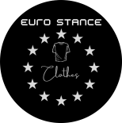

<h1 align="Center">
  
<h1 align="center">Landing Page para uma loja de roupas fictícia</h1>
<h2 align="center">(en = Landing Page to a fictional cloths store)</h2>

<a href="https://eurostanceclothes.netlify.app/" target="_blank" rel="noopener noreferrer">eurostanceclothes.netlify.app/</a>
  

    <li> Sobre (About)</li>
    <li>Efeitos CSS e outros (CSS effects and others)</li>
    <li>Tecnoligias (Tecnoligies)</li>
    <li>Pré-Requisitos (Features)</li>
    <li>Autor (Author)</li>
  

<h1>Sobre</h1>
  <h2>About</h2>
    
 Este projeto tem como finalidade criar uma landing page (página criada para promover um determinado objetivo, neste caso para chamar a atenção para um produto específico     - capuzes de moletom) para uma loja de roupas fictícia,utilizando apenas HTML e CSS

    
This project have the objective to create an landing page (webpage created to promote a specific goal, in this case to bring attention to a specific product - hoodies) to     a fictional clothing store, using only HTML and CSS

<h1 align="center">
  
</h1>

 

<h1>Efeitos CSS e outros (CSS effects and others)</h1>
  <input type = "checkbox" checked> Efeitos na barra de navegaçao superior (Top navigation bar effects) - ok 
  <input type = "checkbox" checked> Efeitos de background na seção Home (Background effects on Home Section) - ok 
  <input type = "checkbox" checked> Seção galeria com efeitos nas fotos (Gallery section with effects on photos) - ok 
  <input type = "checkbox" checked> Formulário de contato com efeito no botão (Contact form with effect on button Submit) - ok 
  <input type = "checkbox" checked> Responsividade na pagina (mobile responsiveness on webpage) - ok   

<h1 align="center">
  
</h1>

<h1>Tecnologias</h1>
<h2>Technologies<h2>

- HTML 5

- CSS 3

 

<h1>Pré-requisitos</h1>
  <h2>Prerequisites</h2>
  <li>Navegador atualizado na última versão (last version browser)</li> 

<h1>Autor</h1>
  <h2>(Author)<h2>
  <h3>Douglas Antonio Muniz Borges</h3> 
  
Visite minhas redes:

  <a href="https://github.com/douglasamb">Github
   
<a href="https://www.linkedin.com/in/douglas-borges-100661232" target="_blank">Linkedin

